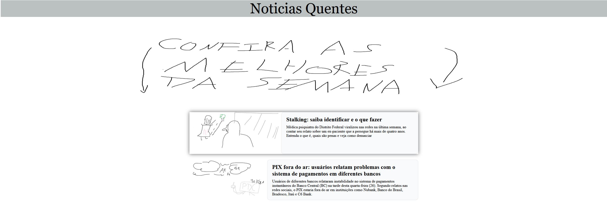

# Trabalho Prático 05 - Semanas 7 e 8

**Páginas de detalhes dinâmicas**

Nessa etapa, vamos evoluir o trabalho anterior, acrescentando a página de detalhes, conforme o  projeto escolhido. Imagine que a página principal (home-page) mostre um visão dos vários itens que existem no seu site. Ao clicar em um item, você é direcionado pra a página de detalhes. A página de detalhe vai mostrar todas as informações sobre o item do seu projeto. seja esse item uma notícia, filme, receita, lugar turístico ou evento.

Leia o enunciado completo no Canvas. 

**IMPORTANTE:** Assim como informado anteriormente, capriche na etapa pois você vai precisar dessa parte para as próximas semanas. 

**IMPORTANTE:** Você deve trabalhar e alterar apenas arquivos dentro da pasta **`public`,** mantendo os arquivos **`index.html`**, **`styles.css`** e **`app.js`** com estes nomes, conforme enunciado. Deixe todos os demais arquivos e pastas desse repositório inalterados. **PRESTE MUITA ATENÇÃO NISSO.**

## Informações Gerais

- Nome: Thiago Nobre
- Matricula: 976584
- Proposta de projeto escolhida: portal de notícias
- Breve descrição sobre seu projeto: notícias com desing engraçado

## Print da Home-Page



## Print da página de detalhes do item


## Cole aqui abaixo a estrutura JSON utilizada no app.js

```javascript
const noticias = [
  {
    id: 1,
    slug: "stalking-saiba-identificar",
    titulo: "Stalking: saiba identificar e o que fazer",
    resumo:
      "Médica do DF viralizou ao relatar perseguição; entenda o que é, quais as penas e como denunciar.",
    imagem: "stalking.png",
    imagemAlt: "Cena ilustrativa representando situação de perseguição",
    categoria: "Segurança",
    autor: "Thiago",
    local: "Beaga",
    dataPublicacao: "2025-10-05T09:18:00-03:00",
    conteudo: {
      paragrafos: [
        "Centenas de mensagens ou ligações de uma mesma pessoa. Comentários invasivos em redes sociais. Perfis falsos que acompanham a rotina e a de familiares e amigos.",
        "O caso ganhou repercussão com o relato de uma médica do Distrito Federal, que afirmou ser perseguida por um ex‑paciente há mais de quatro anos."
      ],
      secoes: [
        {
          titulo: "O que é stalking",
          paragrafos: [
            "Stalking é a perseguição reiterada que invade a privacidade e restringe a liberdade da vítima, podendo ocorrer online ou offline."
          ]
        },
        {
          titulo: "Como agir",
          lista: [
            "Documente todas as evidências (prints, áudios, datas, locais).",
            "Evite contato direto com a pessoa e ajuste a privacidade das contas.",
            "Registre boletim de ocorrência e busque medidas protetivas."
          ]
        }
      ]
    },
    palavrasChave: ["stalking", "perseguição", "segurança"],
    destino: "./detalhes.html?id=1"
  },
];